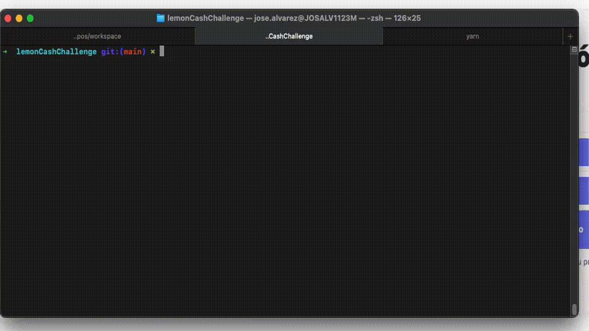

<div align="center">
    
</div>

# Lemon Cash - Challenge 

### Candidato: José Luis Alvarez Maroccolo (alvarez.maroccolo@gmail.com)

[](mailto:alvarez.maroccolo@gmail.com)
[](www.linkedin.com/in/jose-alvarez-maroccolo-07199417)

<br>

 # NOTA - ¡¡¡ ATENCIÓN !!! - LEER
- Incluyo en el proyecto el file .env como tambien los files de google a modo de demostración... en un caso real, estos archivo no estaria incluido en el proyecto.

## Pre-requisitos

 ```
   node: v18.17.1
   yarn: v3.6.4
   java: 17.0.11
   Xcode: 15.1
   react-native: 0.74.2
   react: 18.2.0
 ```

 ## Cómo corro el proyecto ?
 * Instalar paquetes npm ```yarn install ```
   * iOS:
      - Instalar los pods ``` npx pod-install ``` o ``` cd ios ``` y ``` pod install ```
      - Instalar la app en un dispositivo ``` yarn ios```
      - Iniciar metro ``` yarn start ```
   * Android:
      - Instalar la app en un dispositivo ``` yarn android```
      - Iniciar metro ``` yarn start ```

 ## Tiene unit test?
  * Si, para correr los unit test es necesario correr el comando ``` yarn test ```

 ## Tiene reglas de lint?
  * Si, para correr lint es necesario correr el comando ``` yarn lint ```

<br>

# Estructura del proyecto

```
| - src
|  | - api
|  |   - ...
|  | - assets
|  |   - fonts
|  |     - ...
|  |   - images
|  |     - ...
|  | - commons
|  |   - ...
|  | - components
|  |   - ...
|  | - const
|  |   - ...
|  | - context
|  |   - ...
|  | - hooks
|  |   - ...
|  | - interfaces
|  |   - ...
|  | - navigation
|  |   - ...
|  | - reducers
|  |   - ...
|  | - scenes
|  |   - ...
|  |     - components
|  |     - ...
| - App.tsx 
```

 # Librerias usadas
 ```
 @react-native-async-storage/async-storage

   Proporciona una API simple y persistente para el almacenamiento de datos en React Native. 
   Útil para almacenar datos clave-valor de manera asincrónica.
```
 ```
@react-native-google-signin/google-signin:

   Permite integrar la autenticación de Google en aplicaciones React Native. 
   Facilita el inicio de sesión y el manejo de tokens de usuario.
```
```
@react-navigation/drawer:

   Un componente de navegación de cajón (drawer) para React Navigation. 
   Permite la navegación mediante un menú lateral deslizante.
```
```
@react-navigation/native:

   Proporciona los componentes y funciones básicos necesarios para la navegación en aplicaciones React Native. 
   Es el núcleo de React Navigation.
```
```
@react-navigation/native-stack:

   Proporciona una implementación de navegación basada en pilas (stack navigation) para React Navigation, 
   utilizando react-native-screens para un rendimiento mejorado.
```
```
@tanstack/react-query:

   Una biblioteca de gestión de estados asincrónicos para React. 
   Facilita la obtención, almacenamiento en caché, sincronización y actualización de datos del servidor.
```
```
axios:

   Un cliente HTTP basado en promesas para hacer solicitudes HTTP. 
   Es muy popular por su facilidad de uso y capacidades de interceptación.
```
```
lodash:

   Una biblioteca de utilidades de JavaScript que proporciona funciones de ayuda para tareas comunes de programación,
   como la manipulación de matrices y objetos, el tratamiento de cadenas, etc.
 ```

<br>

# Demo en iOS

[](./doc/ios.mp4)

<br>

# Demo en Android

[](./doc/android.mp4)

<br>

# Test

[](./doc/test.mp4)
